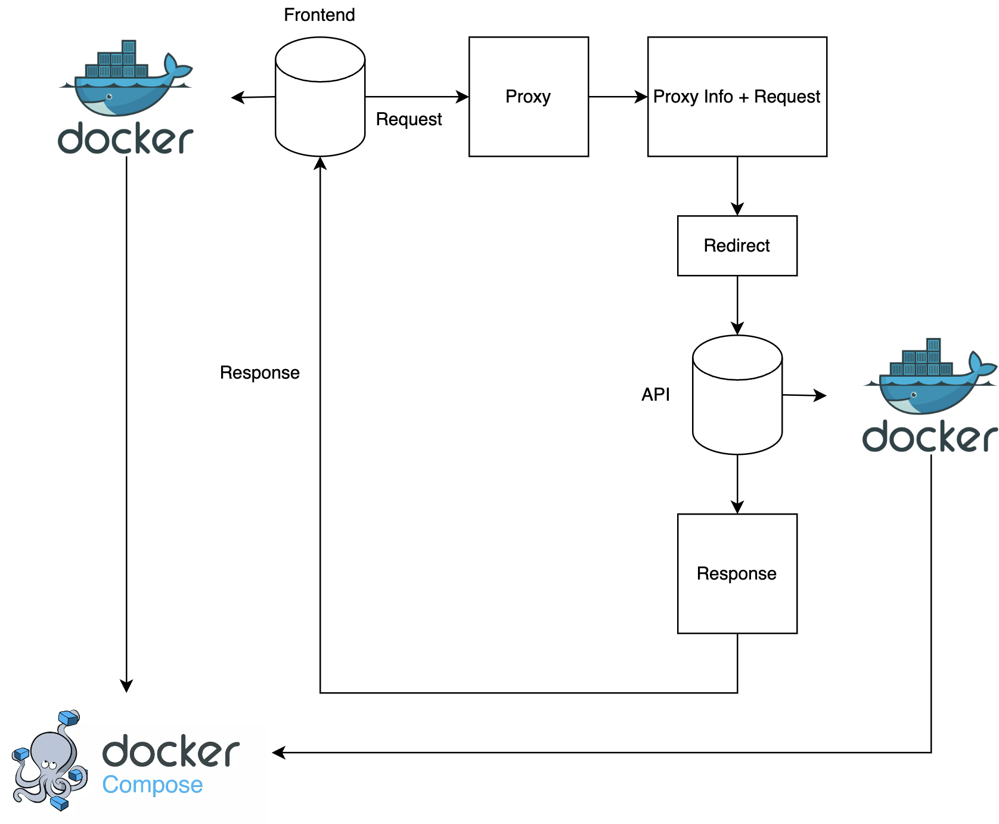

# Xây dựng api tóm tắt văn bản tiếng Việt dùng cho tóm tắt và tóm lượt đơn văn bản

## 1. Công cụ
- Frontend: Streamlit
- Backend: Fastapi
- Proxy: Nginx
- Portal manage: Portainer

## 2. Cài đặt 
Yêu cầu:
+ Python 3.10 trở lên
+ Anaconda để quản lý môi trường (không quá cần thiết)
+ Có GPU ít nhất 4-8GB để chạy mô hình 2 tỉ tham số.
+ Có GPU ít nhất 12GB để chạy mô hình 7 tỉ tham số.
+ Nếu không có GPU thì có thể dùng CPU để thực hiện chạy mô hình nhưng thời gian phản hồi rất lâu.

Cài đặt với **Anaconda** (mở terminal hoặc anaconda prompt):
- Bước 1: tạo môi trường mới bằng công cụ Anaconda
    ```bash
        conda create --name NLP python=3.10
    ```
    bấm phím 'y' để cài đặt môi trường riêng. 

- Bước 2: kích hoạt môi trường vừa được tạo
    ```bash
        conda activate NLP
    ```
- Bước 3: dùng lệnh **cd NLP** để vào mã nguồn và cài đặt toàn bộ thư viện
    ```bash
        pip install -r requirements.txt
    ```
- Bước 4: Sau khi cài đặt thì chạy lệnh bên dưới để mở giao diện frontend
    ```bash
       streamlit run run.py 
    ```
- Bước 5: Sau khi chạy thành công giao diện thì mở một cửa sổ terminal hoặc anaconda prompt khác để chạy API và mô hình
    ```bash
        uvicorn main:app --host 0.0.0.0 --port 5005 --reload
    ```

Cài đặt với **Python** (Không dùng Anaconda):

- Bước 1: dùng lệnh **cd NLP** để vào mã nguồn và cài đặt toàn bộ thư viện
    ```bash
        pip install -r requirements.txt
    ```
- Bước 2: Sau khi cài đặt thì chạy lệnh bên dưới để mở giao diện frontend
    ```bash
       streamlit run run.py 
    ```
- Bước 3: Sau khi chạy thành công giao diện thì mở một cửa sổ terminal hoặc anaconda prompt khác để chạy API và mô hình
    ```bash
        uvicorn main:app --host 0.0.0.0 --port 5005 --reload
    ```

### Lưu ý:
- Vì file mô hình quá nặng nên không thể để trên github, trước khi chạy mã nguồn vui lòng tải xuống lại [model](https://drive.google.com/drive/folders/1cde0ZmlV0euFvhtHjfEeXIX8zxfQH4uF?usp=sharing).
- Vào trong mã nguồn mở thư mục **src** và tạo mới thư mục **weights**, lưu các mô hình tải về ở trong thư mục này.
- Backend cần mất một khoảng thời gian để khởi tạo mô hình, sau khi chạy xong backend cần phải chờ khoảng 30s.
- Tuỳ vào phiên bản và hệ điều hành mà sẽ tự cài đặt bộ **cuda toolkit** tương ứng để chạy mô hình với GPU, nhưng nếu mô hình dùng CPU thay vì GPU nếu máy đã có GPU rời thì chạy lệnh bên dưới để khắc phục.
    ```bash
    pip install torch torchvision torchaudio --index-url https://download.pytorch.org/whl/nightly/cu121
    ```
## 3. Mô hình
Hiện tại hệ thống có 2 mô hình: 2 tỉ tham số và 7 tỉ tham số. <br>
Mô hình được dựng trên mã kiến trúc **Decoder** của **Transformer** <br>
Kết hợp với cơ chế tokenizer của **Gemma** để biểu diễn từ tốt hơn. <br>
Mô hình được thực hiện theo cơ chế Zero shot nghĩa là không huấn luyện cụ thể cho từng loại đơn văn bản hoặc lĩnh vực.

Bảng thống kê thời gian phản hồi của mô hình với GPU **Nvidia 3080 ti**

Bảng thống kê cho loại **tóm tắt chi tiết**
| Số lượng từ nén (%) | Mô hình 2 tỷ tham số (giây) | Mô hình 7 tỷ tham số (giây) |
|---------------------|-----------------------------|-----------------------------|
| 40                  | 9.25                         | 17.4                       |
| 50                  | 12                           | 21.7                       |
| 60                  | 13.5                         | 26                         |
| 70                  | 15.8                         | 30                         |
| 80                  | 17.8                         | 34.7                       |
| 90                  | 20                           | 40                         |

Bảng thống kê cho loại tóm tắt **ngắn gọn**
| Số lượng từ nén (%) | Mô hình 2 tỷ tham số (giây) | Mô hình 7 tỷ tham số (giây) |
|---------------------|-----------------------------|-----------------------------|
| 10                  | 2.5                         | 4.5                         |
| 20                  | 5                           | 8.7                         |
| 30                  | 7                           | 13                          |
| 40                  | 9.3                         | 17.4                        |
| 50                  | 11.2                        | 21.7                        |
| 60                  | 13.7                        | 26                          |

## 4. Triển khai bằng Docker
Có thể triển khai toàn bộ hệ thống thôngg qua **Docker**. <br>
Vì hệ thống được lắp ghép từ 4 **Container** khác nhau nên dùng docker sẽ bất lợi. <br>
Chạy file docker-compose.yaml trong mã nguồn để cài đặt toàn bộ hệ thống
```bash
    docker-compose up -d --build
```
hoặc <br>

```bash
    docker compose -f "docker-compose.yaml" up -d --build 
```

Sơ đồ chung của hệ thống khi triển khai
